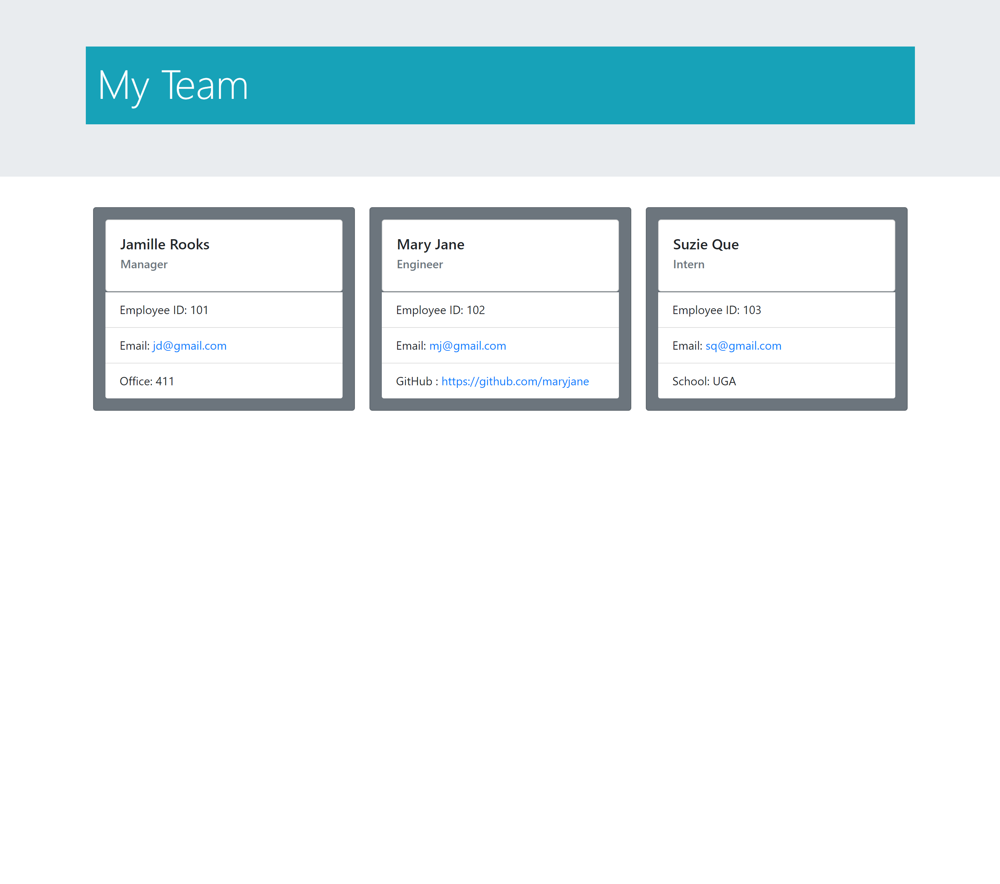

# team-profile-generator
Quickly generate an HTML webpage for your software engineering team

## Description
This is a Node command-line application that takes users input and generates an HTML webpage that displays the summaries for the software engineering team.

## Mockup
A video link to the file: 'https://drive.google.com/file/d/1nV9g2cOb5g9OtxnWDMOLpbPwKN3iwmDD/view'

## Contribution Guidelines
Your suggestions are welcome to help us achieve the goal of improved website accessibility and SEO ranking. 

We use Github and all it's built-in features to host the website, and to pull requests to the local repository.

Report all bugs to Github <a href="https://github.com/issues" target="_blank">issues</a> 

This website uses semantic HTML elements, and universal, element, and class selectors in CSS.

# License
All submissions to this project will fall under <a href="https://choosealicense.com/licenses/mit/"target="_blank">MIT License.</a>
